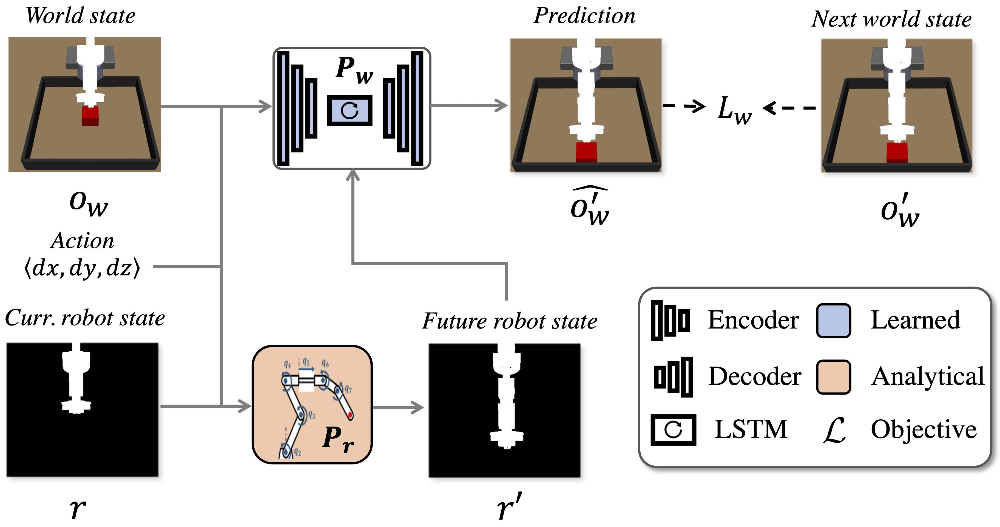

----
## Motivation
Training visuomotor robot controllers from scratch on a new robot typically requires generating large amounts of robot-specific data. Could we leverage data previously collected on another robot to reduce or even completely remove this need for robot-specific data?  We propose a "robot-aware" solution paradigm that exploits readily available robot "self-knowledge" such as proprioception, kinematics, and camera calibration to achieve this. First, we learn modular dynamics models that pair a transferable, robot-agnostic world dynamics module with a robot-specific, analytical robot dynamics module. Next, we set up visual planning costs that draw a distinction between the robot self and the world. Our experiments on tabletop manipulation tasks in simulation and on real robots demonstrate that these plug-in improvements dramatically boost the transferability of visuomotor controllers, even permitting zero-shot transfer onto new robots for the very first time.

 

__TLDR:__ We integrate readily available knowledge about the robot into a learned model and cost function to facilitate transfer to new robots.

----
## Video

    <iframe width="560" height="315" src="https://www.youtube.com/embed/Q_9u6B54iAc" title="YouTube video player" frameborder="0" allow="accelerometer; autoplay; clipboard-write; encrypted-media; gyroscope; picture-in-picture" allowfullscreen></iframe>
    <figcaption>6 minute explanation video.</figcaption>

----

## Robot-Aware Control (RAC)
Our key insight is that the robot and world can be factorized, and that building a robot-aware controller (RAC) that reflects such factorization will facilitate transfer to other robots. Concretely, we extend the visual foresight framework, a popular model based control method, by adding robot awareness in both the dynamics model and planning cost.
 

    
    <figcaption>
        (Left) The modular visual dynamics model that factorizes into a learned world and analytical robot dynamics model. (Right) The unseen robot's analytical model is used to predict robot dynamics, permitting easy robot transfer.
    </figcaption>

 

First, we inject robot awareness into the dynamics model, training it to be invariant to robot appearance, by omitting the robot pixels in its input. This corresponds to a shared robot-invariant "world dynamics" model. We then propose to complete this dynamics model by pairing it with self-knowledge of analytical robot dynamics for each robot. This corresponds to a factorization of the dynamics into world and robot dynamics. Our experiments show that composing these two modules permits reliably transferring visual dynamics models even across robots that look and move very differently.

 

    
    <figcaption>
        The visual dynamics architecture is composed of an analytical robot model, and the learned world model.
    </figcaption>

 

Next, we design a robot-aware planning cost over the separated robot and world pixels. We show that this not only allows visual task specifications to transfer from a source to a target robot, it even leads to gains on the source robot itself by allowing the controller to easily reason about the robot and its environment separately. This allows us to use goal images without robots, or even with humans.
 

    
    <figcaption>
        We analyze the pixel cost and RA cost behavior on a goal image without a robot.
    </figcaption>

 
In the figure above, we illustrate how RA cost behaves correctly versus the conventional pixel-wise cost on a pushing trajectory and a no-robot goal image. The first row shows the feasible trajectory. The next two rows show the heatmaps (pixel-wise norm) between the image and goal for each cost. The heatmaps show high cost values in the robot region, while the RA cost heatmaps correctly have zero cost in the robot region. The plot on the right shows that the pixel cost fails to decrease as the trajectory progresses, while the RA cost correctly decreases. We will show in the experiments that pixel cost is unsuitable for optimization of goal images without robots or with humans.

---

## Prediction Experiment Visualizations
Next, we compare the outputs of the RA dynamics model against the baseline VF+State dynamics model when zero-shot transferred to a new robot. The RA model has better object dynamics prediction, less blurring, and correctly moves the test time robot. 

    <video class="b-lazy" width="70%" controls autoplay muted loop>
        <source src="img/prediction_rollouts.mp4" type="video/mp4">
    </video>

---

## Control Experiment Visualizations
We show goal-reaching episodes from the zero-shot Franka control experiment, where we first train the dynamics models on a dataset of a single WidowX200 robot, and then zero-shot transfer the dynamics models to a Franka robot. The models are used by the visual foresight controller to achieve the goal image using either the RA cost or pixel cost. Going forward we refer to all controllers by the names of the dynamics model and the cost, e.g., RA/RA for the full robot-aware controller. The fully robot-aware pipeline (RA/RA) has a success rate of 90%, whereas the baselines and ablations have below 20% success.

    <video class="b-lazy" width="100%" controls autoplay muted loop>
        <source src="img/control_rollouts.mp4" type="video/mp4">
    </video>

Here, we take a peek under the hood of the controlleres by plotting the top 5 trajectories generated by each model during action optimization. We can see the baseline VF+State model fails to model the watermelon motion, whereas the RA model successfully models the downward motion of the watermelon. 

    <video class="b-lazy" width="80%" controls autoplay muted loop>
        <source src="img/cem.mp4" type="video/mp4">
    </video>

## Cost Experiment Visualizations
Here, we show that the RA cost can compute sensible distances for goal images with different agents such as humans, or goal images without any robots. Planners that compute the pixel cost for the same goal images result in failure. 

    <video class="b-lazy" width="80%" controls autoplay muted loop>
        <source src="img/human_goal.mp4" type="video/mp4">
    </video>

